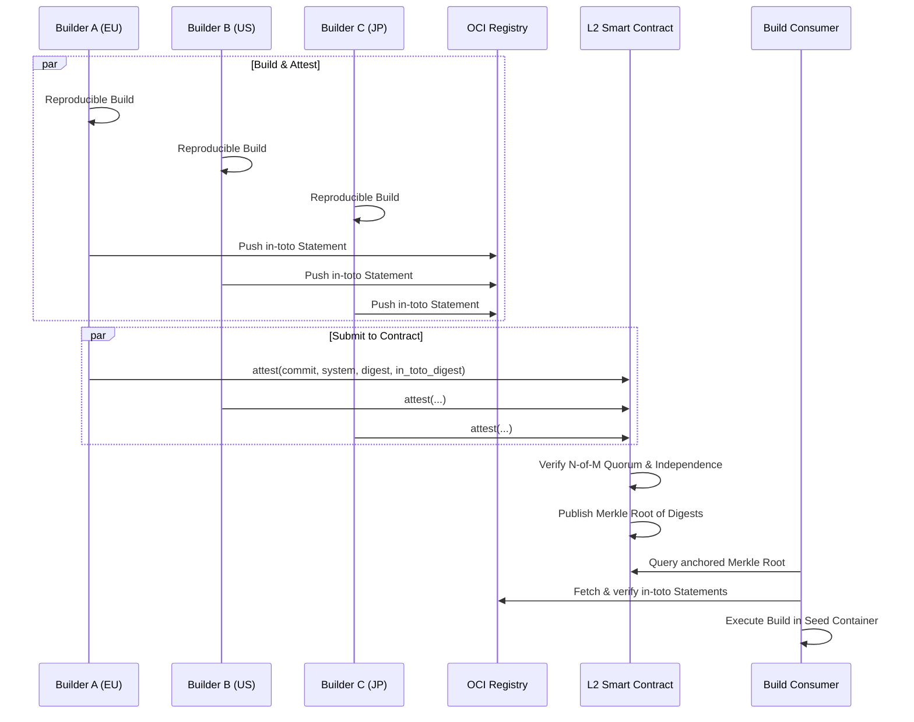

# Nix Seed: Design

<!--toc:start-->
- [Architecture](#architecture)
- [Performance](#performance)
  - [Constraints](#constraints)
  - [Instrumentation](#instrumentation)
  - [Comparisons](#comparisons)
- [Seed Construction](#seed-construction)
  - [Non-Container Results](#non-container-results)
- [Trust](#trust)
  - [Bootstrap Chain](#bootstrap-chain)
  - [Quorum](#quorum)
  - [Modes](#modes)
  - [Development](#development)
  - [Production](#production)
    - [Genesis](#genesis)
    - [L2 Gas Costs](#l2-gas-costs)
    - [Governance Constraints](#governance-constraints)
  - [Implicit Trust Boundary](#implicit-trust-boundary)
- [Project Attack Surface](#project-attack-surface)
- [Threat Actors](#threat-actors)
- [.gov](#gov)
  - [Legal](#legal)
  - [Extra-legal](#extra-legal)
- [Other](#other)
  - [China](#china)
  - [Russia](#russia)
- [Controls](#controls)
- [Compliance](#compliance)
- [Footnotes](#footnotes)
<!--toc:end-->

Goal: Near-zero setup time for happy-path builds (application code change only)
on non-Nix-native CI[^ci] runners[^runner].

The implementation leverages OCI[^oci] seed images, to package a project's
dependency closure as content-addressed OCI layers, eliminating per-job
reconstruction of `/nix/store`.

Verifiable integrity is an inherent property of the system, enforced by the
cryptographic linkage between source code, its dependency closure, and the
resulting build artifacts.

## Architecture

> [!NOTE]
>
> A **digest** is a unique cryptographic fingerprint of a file's contents. If
> the contents change by a single byte, the fingerprint changes entirely. Nix
> Seed uses this to prove exactly what code went into a build.

The release pointer is the OCI image digest
(`ghcr.io/org/repo.seed@sha256:<digest>`). Registry[^registry] tags and metadata
are non-authoritative.

Layering is delegated to `nix2container`[^nix2container]. Execution is handled
by workflow scripts external to the container.

### Performance

- Closure realization is replaced by pulling and mounting an OCI filesystem
  image.
- Setup cost scales with dependency change since the last seed.
- Source fetch (shallow clone size) is unchanged.
- Build execution time is unchanged.

#### Constraints

- Requires an OCI registry. A CI provider with a co-located registry is
  preferred for performance, but not required.
- Darwin builds must be run on macOS builders if they require Apple SDKs. A
  runner with a differing SDK version produces a differing NAR digest and fails
  deterministically.

#### Instrumentation

Jobs are instrumented with OpenTelemetry[^opentelemetry] spans for:

- seed pull
- mount ready
- build start
- seed build (when a new seed is required before the app build)
- digest verification

Primary metric: time-to-build (setup time).

#### Comparisons

This project can generate CI workflows that compare setup-time overhead against
cache-based approaches (e.g. public binary cache, actions/cache based) for
benchmarking / evaluation.

The benchmark command is:

- `nix develop --command true`

### Seed Construction

1. The seed build evaluates a Nix-built project.
1. `nix2container`[^nix2container]: produces an OCI image of the dependency
   closure, whose layers correspond to store paths, and a metadata manifest,
   which includes image digest.
1. The image is pushed to an OCI registry.

`nix2container` is a pinned flake input; its version and digest are verified by
the Nix build system under the same supply chain trust model as all other
dependencies.

Nix Seed itself is equally a pinned flake input; its digest is verified by the
same mechanism, binding build orchestration code to a specific auditable
revision.

Seed builds are executed offline by passing `--network none` to the container
runtime.

#### Non-Container Results

Nix Seed works for any Nix build, not only those producing OCI images. When the
project build produces a NAR[^nar] (binary, library, development shell, or other
derivation output), the seed container still ships all dependencies as OCI
layers; the project build runs inside it and produces its output to the local
Nix store.

In this case the release pointer is the NAR content-addressed digest of the
build output rather than an OCI image digest. The trust and attestation model is
identical: the in-toto statement binds the output artifact digest, and (in
Production mode) that digest is anchored on-chain. An OCI registry is required
for the seed itself; the project build result does not need to be pushed to a
registry.

### Trust

#### Bootstrap Chain

> The source was clean, the build hermetic, but the compiler was pwned.

The Trusting Trust[^trusting-trust] attack has no software fix. The only
protection is a compiler chain that terminates at a human-auditable ground
truth.

The Nixpkgs chain builds through:

- The initial binary, [stage0-posix](https://github.com/oriansj/stage0-posix), a
  self-hosting assembler whose bootstrap binary is a few hundred bytes of
  hex-encoded machine instructions - there is no opaque compiler binary to
  trust.
- [GNU Mes](https://www.gnu.org/software/mes/) - a minimal C compiler and Scheme
  interpreter bootstrapped entirely from the assembler
- [tcc](https://bellard.org/tcc/)
- [gcc](https://gcc.gnu.org/)
- [live-bootstrap](https://github.com/fosslinux/live-bootstrap).

The entire chain is coordinated with
[bootstrappable.org](https://bootstrappable.org/).

**Cost is already paid.** Full source bootstrap exists in nixpkgs regardless
of this project. Seed images cache its output: the first build after a seed
update pays the bootstrap cost once; subsequent CI jobs pull pre-built layers.

Consumers who need independent verification can rebuild from the stage0 binary,
reproduce the full closure, and check the digest against the anchored value.
This is a one-time audit activity that takes on the order of days of compute,
not a per-release operation. The content-addressed layers provide a direct
correspondence between what is pulled and what was built.

#### Quorum

> [!WARNING]
>
> Reproducible builds are a hard prerequisite. Without reproducibility,
> diverging digests are indistinguishable from a subverted build - the system
> cannot determine which builder is correct and quorum fails permanently.
>
> Verify with `nix build --check`. See
> [reproducible-builds.org](https://reproducible-builds.org/).

Releases may require N-of-M[^n-of-m] builder[^builder] agreement on the
image digest.

Quorum is only meaningful if builders span independent failure domains:
organization, jurisdiction, infrastructure, and identity issuer.

**Signing identity independence** requires that no single operator controls the
signing identities of multiple quorum builders. In Dev mode, identity is
established via OIDC issuer: GitHub Actions
(`token.actions.githubusercontent.com`) and Azure Pipelines
(`vstoken.dev.azure.com`) share a Microsoft-controlled issuer and do not satisfy
identity independence when combined. In Production mode, identity is
established by registered contract key; OIDC issuer is not a factor.

**Choosing N:** each of the N required builders should have a distinct
`corporateParent`, `jurisdiction`, and signing identity. N >= 3 is a practical
minimum; below that a single adversary controlling two independent entities can
forge a majority. Unanimous (M-of-M) is the strongest guarantee. See
[`modules/seedcfg.nix`](modules/seedcfg.nix) and
[`modules/builders.nix`](modules/builders.nix) for the builder registry schema.

**Timing:** in Dev mode with N-of-M and a deadline, a party controlling M-N
builders can delay attestation to ensure the deciding N-th vote comes from a
builder of their choice. Production mode eliminates this: attestations
accumulate indefinitely and quorum is declared when the threshold is met, not
when a timer expires.

If builders disagree on the digest, release fails.

#### Modes

##### Development

> [!WARNING]
>
> **Not for production.** Dev mode depends on Rekor[^rekor] availability
> and external OIDC[^oidc] trust roots. Use [Production mode](#production) for
> production releases.

Each project maintains a `.seed.lock` containing a digest per target system:

```json
{
  "aarch64-darwin": "sha256:...",
  "aarch64-linux": "sha256:...",
  "x86_64-darwin": "sha256:...",
  "x86_64-linux": "sha256:..."
}
```

If no digest exists for a system, the seed is built, the resulting digest is
recorded in a new commit containing the updated `.seed.lock`, and the normal
build proceeds.

After each build, an in-toto[^in-toto] statement is generated describing inputs
and build metadata, signed via OIDC[^oidc]/KMS[^kms] using cosign[^cosign],
logged to Rekor[^rekor], and published to the registry as a referrer artifact
keyed by the build result digest. No mutable registry state is trusted.

At minimum, the statement must bind:

- source repository URI
- source commit digest
- flake.lock content digest
- target `system`
- output artifact digest
- builder identity and issuer
- build timestamp and workflow run ID

**Consumption:**

1. Read seed digest for the current system from `.seed.lock`.
1. Verify: attestation signature is valid; Rekor log inclusion is valid;
   statement contents match expected inputs.
1. Execute build steps in seed container by digest.

> [!WARNING]
>
> Rekor has no enterprise SLA. If Rekor is unavailable, quorum cannot be reached
> and builds fail. For production use, use [Production mode](#production).
>
> [!NOTE]
>
> Builder cache configuration (substituters[^substituter]) is not attested in
> Dev mode. Two builders both substituting from the same cache (e.g.
> `cache.nixos.org`) are trusting the cache operator rather than independently
> building. This is acceptable in development; for production, use
> [Production mode](#production) where the constraint is enforced by the
> contract.

##### Production

*(Note: Production mode uses a public blockchain (Ethereum Layer 2) as an
append-only public ledger. Builders post their results there, and a smart
contract automatically verifies that enough independent builders got the exact
same result before approving a release.)*

> [!WARNING]
>
> **No substituters.** Each builder must build its closure locally from source
> with binary caches disabled. Build independence is the source of quorum's
> security guarantee: N builders on N independent stacks must all produce the
> same digest. If builders substitute from a shared cache, the cache operator -
> not N independent builds - is what produced the attested digest. The
> independence constraints the contract verifies (`corporateParent`,
> `jurisdiction`, infrastructure) are vacuous if all builders are serving the
> same pre-built narinfo.
>
> [!NOTE]
>
> The L2 contract maintains a builder revocation list. If a builder is
> retroactively found compromised, its identity is added to the list; the
> contract excludes its attestations from quorum counting. Prior seed releases
> that relied on the revoked builder should be re-evaluated.

A *seed release* is a set of image digests, one per target system. This is
distinct from a project release (git tag); a project release may reference one
or more seed releases.

The on-chain record is intentionally minimal to limit calldata[^calldata] cost.
Each builder additionally produces an in-toto[^in-toto] statement binding full
provenance:

- source repository URI
- source commit digest (full 40-hex SHA-1 or 64-hex SHA-256)
- `flake.lock` content digest
- target `system`
- output artifact digest
- builder identity (contract address)
- build metadata (`nix show-config` output, workflow run ID)

Each builder signs the statement with its registered key (not OIDC[^oidc]) and
publishes it to the OCI registry as a referrer artifact keyed by the build
result digest. Rekor[^rekor] is not used; the OCI registry hosts the provenance.
The contract anchor proves N builders agreed on the digest; the in-toto
statements prove what was built.



Storing the full in-toto statement on-chain is feasible but not recommended. A
typical statement is 1,000-2,000 bytes; at 16 gas per non-zero calldata byte
that adds roughly 16,000-32,000 gas per builder per system - a 10-20x increase
in calldata cost - and bloats L2 data availability. Instead, the statement digest
is anchored on-chain (32 bytes, negligible cost) as a fourth parameter
`attest(commit, system, digest, in_toto_digest)`. This binds the off-chain
provenance to the quorum record without the size cost.

Each builder holds a persistent signing key registered in the contract at
genesis. A build produces a single on-chain transaction:

```solidity
attest(commit, system, digest, in_toto_digest)
```

signed by the builder's registered key. The contract records
`(commit, system, digest, in_toto_digest, builder_address, block_number)` for each submission,
then:

1. Checks that N distinct registered builders have submitted the same
   `(commit, system, digest, in_toto_digest)` tuple.
1. Verifies independence constraints across the N builders (`corporateParent`,
   `jurisdiction`, infrastructure, substituters).
1. When quorum is satisfied across all target systems, publishes the digest tree
   as a single Merkle root[^merkle-root]:
   - hash function = `keccak256`
   - leaf bytes =
     `0x00 || u16be(len(system)) || utf8(system) || imageDigestBytes`
   - internal node bytes = `0x01 || leftHash || rightHash`
   - leaf order = lexical ascending by `system`
   - odd leaf handling = duplicate the final leaf at each level
   - root = Merkle root across all systems
1. The anchored[^anchor] root is immutable.

No deadline is required. The contract accumulates attestations indefinitely;
quorum is declared when the threshold is met. The blockchain is the transparency
log - no separate log service is required.

The master builder's role is reduced to monitoring the contract for the
published root. Master-builder trust is removed from the promotion path.

**Key management:** builder keys are persistent secrets held in CI secret
stores. Compromise triggers revocation via the contract's governance multi-sig
(see [Governance Constraints](#governance-constraints)). Keys are registered at
genesis and rotated by contract multi-sig.

**Why CI key compromise still matters:** the contract verifies that `N` distinct
registered builder keys signed the same tuple. It does not distinguish an
authorized signer from an attacker using a stolen key. If fewer than `N` keys
are compromised, quorum blocks promotion; if `N` or more are compromised, a
malicious digest can satisfy quorum until revocation occurs.

Builders must enforce `substituters =` (empty) and `trusted-substituters =`
(empty). The effective `nix show-config` output is included in the in-toto
statement so verifiers can reject substituted builds.

> [!NOTE]
>
> The L2 contract verifies the *claim* of independence via attested build
> metadata, not a cryptographic proof of local execution. A compromised builder
> can spoof its `nix show-config` output. Quorum still limits the damage: this
> only matters if N or more builders are simultaneously compromised and
> coordinating the same lie.

The `.seed.lock` file is not used.

**Consumption:** The contract must not be empty; see [Genesis](#genesis).

1. Query the L2 contract for the current anchored Merkle root.
1. Verify inclusion proof for the current system; extract digest.
1. Fetch in-toto provenance statements from OCI artifact; verify each signature
   against the builder's registered contract address; verify statement contents
   match expected source URI, commit, and `flake.lock` digest.
1. Execute build steps in seed container by digest.

Contract quorum verification subsumes the Rekor log check. In-toto provenance is
verified separately via the OCI artifact.

###### Genesis

The first seed has no prior quorum to bootstrap from. Genesis is a controlled
ceremony distinct from normal builds:

1. All configured builders (M-of-M, unanimous) build the seed independently from
   source.
1. Each builder submits a genesis attestation to the contract via their
   registered key.
1. The contract requires unanimous attestation and verifies full independence
   across all M builders before accepting the genesis root.
1. Genesis is finalized by a multi-signature transaction requiring all M builder
   keys; no single party can unilaterally declare genesis.
1. An empty contract state rejects all non-genesis builds. Genesis must be
   completed before any seed can be consumed.

Post-genesis builds use the standard N-of-M threshold. The genesis root is the
immutable trust anchor.

> [!NOTE]
>
> Air-gapping builder hardware during the genesis ceremony eliminates the risk
> of network-level attacks on the trust anchor. Firmware injection remains a
> risk. This is best practice but expensive: most teams perform genesis on
> hardened CI infrastructure instead. Document the environment used; publish a
> signed incident record if it is later found compromised.

###### L2 Gas Costs

Gas[^gas] cost depends on calldata[^calldata] size, state writes, and current L2
fee conditions. The ranges below are planning estimates for a quorum of 3
builders across 4 systems (`aarch64-darwin`, `aarch64-linux`, `x86_64-darwin`,
`x86_64-linux`), not guarantees.

- `attest(commit, system, digest, in_toto_digest)` submission (per builder per system):
  - expected gas: 120,000 to 220,000
  - expected cost: 0.00006 to 0.00022 ETH
  - expected USD (ETH = $3,000): $0.18 to $0.66
- total attestations (3 builders × 4 systems = 12 submissions):
  - expected gas: 1,440,000 to 2,640,000
  - expected cost: 0.00072 to 0.00264 ETH
  - expected USD (ETH = $3,000): $2.16 to $7.92
- root publication (once quorum is met for all 4 systems):
  - expected gas: 180,000 to 320,000
  - expected cost: 0.00009 to 0.00032 ETH
  - expected USD (ETH = $3,000): $0.27 to $0.96

Total anchoring overhead per release: 0.00081 to 0.00296 ETH ($2.43 to $8.88 at
ETH = $3,000), excluding unusual fee spikes.

###### Governance Constraints

- Governance multi-sig must be independent from builder keys.
- Threshold should be at least 2-of-3 for emergency revocation/rotation.
- If a genesis key is lost before finalization, restart genesis with a new
  builder set and publish a signed incident record.
- If keys are lost post-finalization such that the multi-sig drops below the
  rotation threshold (e.g., 2-of-3), the L2 contract is permanently bricked for
  that project and requires a hard fork to a new contract.
- If a builder is revoked post-genesis, re-evaluate affected releases and
  republish status.

#### Implicit Trust Boundary

While the design mitigates many attack vectors, it relies on two fundamental
trust assumptions:

1. **The `flake.lock` Bottleneck:** Nix Seed guarantees *what is in git is what
   is built*. If a maintainer merges a malicious dependency update into
   `flake.lock`, Nix Seed will faithfully build, attest, and anchor the malware.
   The cryptographic system does not audit code intent; it only binds the output
   to the input. Human review of lockfile updates remains a critical security
   boundary.
2. **Registry Tampering:** The OCI registry is treated as an untrusted blob
   store. The trust boundary assumes the local OCI client (Docker/Podman/Skopeo)
   correctly verifies that the digest of the fetched content matches the
   requested digest. We trust the math of content-addressing, not the service
   providing the bytes.

### Project Attack Surface

This project is intentionally low-code: it mainly defines build policy,
verification rules, and workflow wiring around existing Nix container systems.
That limits direct application attack surface because there is little custom
runtime logic to exploit.

The primary risk is **misconfiguration**, not complex code execution. The
highest-impact failure modes are:

- accepting mutable references (tags) instead of digests,
- weak quorum/independence configuration,
- enabling substituters[^substituter] in L2[^l2] mode,
- trusting unsigned or under-specified attestations[^attestation],
- insecure key handling in CI.

Security work should prioritize strict defaults, immutable references,
verification-by-default, and auditable configuration over adding new
orchestration code.

## Threat Actors

### .gov

The United States government has structural dominance over the global internet:
ICANN controls domain name resolution and root DNS; the majority of root
certificate authorities are US-headquartered; BGP[^bgp] routing registries are
US-operated; and every major cloud provider, CDN, software distribution
platform, and CI service is either US-incorporated or subject to US
jurisdiction. This is not merely a legal posture - it is the physical and
organizational topology of the internet.

The legal tools described below are available to any `.gov` actor. Extra-legal
tools extend the reach further. The design constraint is that no single
jurisdiction should be capable of unilaterally subverting a release.

#### Legal

All major public cloud providers are subject to the CLOUD Act[^cloud-act], FISA
Section 702[^fisa-section-702], and National Security Letters[^nsl], any of
which can compel infrastructure access without public notice.

NSLs[^nsl] require no judicial approval and carry a gag order. The provider's
compliance team will not notify you. An administration that has fired inspectors
general in bulk, declared independent agencies optional, and installed loyalists
at the DOJ has the same legal access to your build infrastructure as any other.

> [!WARNING]
>
> *Sovereign Cloud is a bullshit marketing term*: providers claim jurisdictional
> isolation but remain US-operated entities under US law. An AWS EU Region is
> still Amazon. An Azure Government cloud is still Microsoft. Jurisdiction
> follows the operator, not the data center. CI platforms headquartered in the
> US therefore inherit the same exposure regardless of where their runners
> execute.
>
> Region selection provides performance and data residency properties only; it
> does not alter legal jurisdiction.

A quorum composed entirely of US-headquartered CI providers is legally a single
failure domain. Practically, a meaningful quorum requires that at least one
quorum builder be:

- Self-hosted on hardware controlled by an organization incorporated outside the
  US.
- Operated in a jurisdiction with no mutual legal assistance treaty (MLAT) with
  the US, or with significant friction in its execution (MLAT[^mlat]).

Legal compulsion to *attest a specific digest* - a builder operator required
under gag order to submit a false result - is not addressed by the cryptographic
design. Quorum limits the damage: an adversary must coerce N independent
operators simultaneously, across independent jurisdictions if configured
correctly.

#### Extra-legal

Legal process is the slow path. A well-resourced signals intelligence agency has
other options.

**Five Eyes:** the UKUSA agreement extends NSA collection to GCHQ (UK), CSE
(Canada), ASD (Australia), and GCSB (New Zealand). A builder in any Five Eyes
jurisdiction is not meaningfully separate from a US builder.

**Active network attack:** QUANTUM INSERT[^quantum-insert] allows injection of
malicious content into unencrypted or MITM-able traffic. BGP[^bgp] hijacking has
been used to redirect traffic through collection points. DNS manipulation is
within documented capability.

**Hardware interdiction:** TAO[^tao]'s ANT catalog[^ant-catalog] documents
implants for network equipment, hard drives, and server hardware. Supply chains
routed through US logistics are interdiction targets. (Note: purely non-US COTS
hardware is practically impossible; the mitigation relies on N independent
stacks so an implant must hit multiple targeted supply chains simultaneously).

**Cryptographic risk:** NSA seeded a backdoor into Dual_EC_DRBG[^dual-ec-drbg]
(NIST SP 800-90A). Any NIST-blessed primitive must be considered tainted.
P-256[^p-256] (used in cosign/ECDSA) is NIST-approved - use Ed25519[^ed25519] as
the standard signing algorithm. Note: Azure Key Vault does not support Ed25519
natively (requires Managed HSM[^hsm] tier); if Azure is a mandatory builder,
P-256/P-384 may be forced.

**System impact:**

- **Dev mode:** Rekor submissions, OIDC token issuance, and registry
  traffic are all passively observable. The transparency log is transparent to
  the adversary by design.
- **Production mode:** contract transactions are public by design; no
  additional surveillance surface. Builder keys stored in CI secret stores on
  US-provider infrastructure are accessible via PRISM[^prism] without the
  builder's knowledge.
- **Any mode:** a builder running on hardware that passed through US logistics
  may carry a firmware implant. A builder on a US cloud provider's VM is running
  on hardware the adversary may have pre-implanted.

**Mitigations:**

- Use Ed25519 over P-256 for all signing operations.
- Store genesis and builder keys in HSMs, not CI secret store environment
  variables. A hardware token that cannot exfiltrate the private key raises the
  cost of compromise significantly.
- At least one quorum builder should be on non-Five-Eyes[^five-eyes]
  infrastructure with a documented, audited supply chain.
- The Production mode contract design already provides the strongest available
  mitigation: N independent signers on N independent hardware stacks must all be
  compromised simultaneously. Cost scales with N.

No software-only solution running on commodity cloud hardware in an automated CI
environment is proof against a well-resourced adversary with hardware access.
The goal is not to be NSA-proof - that requires air-gapped hardware signing
ceremonies outside the scope of CI. The goal is to make passive supply-chain
compromise of a *release* require active, targeted, multi-system attack that is
detectable, attributable, and expensive.

______________________________________________________________________

### Other 

| Actor | Org | Capability | Mode at risk |
| --- | --- | --- | --- |
| China | MSS / PLA Unit 61398 | Supply chain, HUMINT | Dev, Production |
| Russia | GRU / SVR / FSB | Build pipeline | Dev |
| North Korea | RGB / Lazarus Group | Credential theft | Dev, Production |
| Iran | IRGC / APT33-APT35 | Spear phishing | Dev |
| Israel | Unit 8200 / NSO Group | Zero-day, implants | All |
| Criminal | Ransomware, insider threat | Credential theft | Dev |

#### China

China's National Intelligence Law (2017)[^national-intelligence-law] compels any
Chinese entity - including Alibaba Cloud - to cooperate with intelligence
services on demand and without disclosure. A quorum that includes Alibaba Cloud
or any runner operated by a Chinese-headquartered entity is not legally
independent.

PLA Unit 61398 and MSS-linked groups (APT10, APT41) have demonstrated sustained
supply-chain targeting, including software-update hijacking and build-server
compromise. The Production mode design raises the cost by requiring simultaneous
across N independent builder networks.

HUMINT recruitment of build-system maintainers is not addressed by any technical
control. Key ceremony discipline and HSM-resident keys limit insider blast
radius: an insider can attest a bad build, but cannot retroactively forge the
quorum.

#### Russia

SUNBURST (SolarWinds)[^sunburst] is the canonical build-pipeline attack: GRU /
SVR operators compromised the SolarWinds Orion build system and inserted a
backdoor that was signed with the legitimate code-signing key. A multi-builder
quorum would not have prevented a single-builder build compromise - but would
have caught it: independent builders would attest a *different* digest, breaking
quorum and blocking promotion.

SORM[^sorm] requires Russian ISPs to provide FSB with real-time access to all
traffic. Runners in Russia or on Russian cloud infrastructure are subject to
passive interception regardless of TLS[^tls]. Reproducible builds mean an
observer who intercepts a build gets the same artifact but cannot inject code
without breaking the digest.

### Controls

The [xz-utils backdoor (2024)](https://tukaani.org/xz-backdoor/) demonstrated
that a patient attacker can socially engineer maintainer trust over years.

Controls:

- **Quorum over commits**: if any one builder's reproducible build diverges, the
  build fails.
- **CI secret store credential theft** (session tokens, registry push
  credentials) is the most common criminal vector. HSM-resident builder keys
  defeat environment-variable exfiltration. Production mode removes the registry
  push credential from the critical path entirely: the contract controls
  promotion,  not a CI secret.
- **Ransomware** targeting CI infrastructure disables builds but cannot forge
  attestations. Redundant builders provide availability.

______________________________________________________________________

## Compliance

Upstream license terms for non-redistributable SDKs are fully respected.

______________________________________________________________________

## Footnotes

[^anchor]: **Anchor:** Writing a release fingerprint (digest or Merkle root) to
    an immutable ledger so it cannot be silently changed later.

[^ant-catalog]: **[ANT catalog](https://en.wikipedia.org/wiki/ANT_catalog):**
    NSA's classified menu of hardware and software implants for targeted
    surveillance, leaked by Snowden in 2013. Documents implants for network
    equipment, hard drives, and server firmware.

[^attestation]: **[Attestation](https://slsa.dev/attestation-model):** A
    verifiable record that a specific build occurred from specified inputs by a
    known builder.

[^bgp]: **[BGP](https://www.rfc-editor.org/rfc/rfc4271):** Border Gateway
    Protocol (RFC 4271). The routing protocol that directs traffic between
    autonomous systems on the internet. BGP hijacking redirects traffic through
    an adversary-controlled network path.

[^bootstrappable builds]: **[project and
    community](https://bootstrappable.org/)** focused on enabling software to
    be built from a minimal, auditable binary seed, eliminating implicit trust
    in compiler binaries. Coordinates the stage0, GNU Mes, and live-bootstrap
    projects.

[^builder]: **Builder:** A machine or CI runner that performs a build and
    submits evidence (attestations).

[^calldata]:
    **[calldata](https://ethereum.org/en/developers/docs/transactions/):** The
    input data payload of an Ethereum transaction.

[^ci]: **[CI](https://en.wikipedia.org/wiki/Continuous_integration):**
    Continuous Integration. The practice of automating the integration of code
    changes from multiple contributors into a single software project.

[^cloud-act]: **[CLOUD Act](https://www.justice.gov/dag/cloudact):** Clarifying
    Lawful Overseas Use of Data Act (2018). Requires US-operated providers to
    produce data stored abroad when served with a US warrant, regardless of
    physical location.

[^cosign]: **[cosign](https://docs.sigstore.dev/cosign/overview/):** Sigstore
    tool for signing, verifying, and storing signatures and attestations in OCI
    registries.

[^dual-ec-drbg]: **[Dual_EC_DRBG](https://en.wikipedia.org/wiki/Dual_EC_DRBG):**
    Dual Elliptic Curve Deterministic Random Bit Generator. A NIST-standardized
    PRNG (SP 800-90A) subsequently confirmed to contain an NSA-planted backdoor.

[^ed25519]: **[Ed25519](https://ed25519.cr.yp.to/):** Edwards-curve Digital
    Signature Algorithm over Curve25519. Not NIST-standardized.

[^fisa-section-702]: **[FISA Section
    702](https://www.dni.gov/index.php/704-702-overview):** Foreign Intelligence
    Surveillance Act Section 702. Authorizes warrantless collection of
    communications of non-US persons from US-based providers.

[^five-eyes]: **[Five Eyes](https://en.wikipedia.org/wiki/Five_Eyes):** UKUSA
    signals intelligence alliance: United States (NSA), United Kingdom (GCHQ),
    Canada (CSE), Australia (ASD), New Zealand (GCSB). Intelligence collected by
    any member is shared across all.

[^gas]: **[Gas](https://ethereum.org/en/developers/docs/gas/):** The unit used
    to measure computational work on EVM-compatible chains. Transaction fee =
    gas used * gas price.

[^hsm]: **[HSM](https://en.wikipedia.org/wiki/Hardware_security_module):**
    Hardware Security Module. Tamper-resistant hardware device for cryptographic
    key storage and operations. Private keys cannot be exported; signing occurs
    inside the device.

[^in-toto]: **[in-toto](https://in-toto.io/):** Framework for securing software
    supply chains by defining and verifying each step in a build pipeline via
    signed link metadata.

[^kms]: **KMS:** Key Management Service. A managed system used to store
    cryptographic keys and perform signing operations without exposing private
    key material to build scripts. See [NIST SP
    800-57](https://csrc.nist.gov/pubs/sp/800/57/pt1/r5/final) for key
    management recommendations.

[^l2]: **[L2](https://ethereum.org/en/layer-2/):** Ethereum Layer 2. A network
    that records transactions and ultimately settles them to Ethereum (L1). In
    this design, it is used as an immutable public ledger for release anchors.

[^merkle-root]: **[Merkle root](https://en.wikipedia.org/wiki/Merkle_tree):** A
    single digest that summarizes a tree of digests and allows efficient inclusion
    proofs for each leaf.

[^mlat]:
    **[MLAT](https://en.wikipedia.org/wiki/Mutual_legal_assistance_treaty):**
    Mutual Legal Assistance Treaty. Bilateral or multilateral agreement for
    cross-border legal cooperation, including evidence requests. Processing time
    varies from months to years.

[^n-of-m]: **N-of-M:** Out of `M` configured builders, at least `N` independent
    builders must report the same result.

[^nar]: **[NAR](https://nix.dev/manual/nix/stable/glossary):** Nix Archive.
    Canonical binary serialization of a Nix store path, used as the input to
    content-addressing. The NAR digest of a path must match its declaration;
    mismatch fails the build.

[^national-intelligence-law]: **[National Intelligence Law
    (2017)](https://www.chinalawtranslate.com/en/national-intelligence-law/):**
    Chinese law compelling any Chinese entity to cooperate with intelligence
    services on demand and without public disclosure.

[^nix2container]: **[nix2container](https://github.com/nlewo/nix2container):**
    Provides an efficient container build workflow for Nix

[^nsl]: **[NSL](https://www.eff.org/issues/national-security-letters):**
    National Security Letter. Administrative subpoena issued without judicial
    review. Carries a statutory gag order: the recipient cannot disclose that
    the letter was received.

[^oci]: **[OCI](https://opencontainers.org/):** Open Container Initiative.
    Industry standards for container image format, distribution, and runtime.

[^oidc]: **[OIDC](https://openid.net/connect/):** OpenID Connect. Identity layer
    on OAuth 2.0. Used here for keyless signing: a CI platform issues a
    short-lived OIDC token asserting the workflow identity, which cosign uses as
    the signing credential.

[^opentelemetry]: **[OpenTelemetry](https://opentelemetry.io/):** Vendor-neutral
    observability framework for collecting traces, metrics, and logs. Used here
    to instrument CI job phases (seed pull, mount, build) with structured spans
    for timing analysis.

[^p-256]: **[P-256](https://csrc.nist.gov/pubs/fips/186/5/final):** NIST P-256
    elliptic curve (secp256r1), defined in FIPS 186-5. Used in ECDSA.
    NIST-standardized and widely deployed; treat as potentially weakened given
    the Dual_EC_DRBG precedent.

[^prism]: **[PRISM](https://en.wikipedia.org/wiki/PRISM):** NSA program for
    collection of stored internet communications directly from major US tech
    companies under FISA Section 702 authority.

[^quantum-insert]: [QUANTUM
    INSERT](https://en.wikipedia.org/wiki/QUANTUM_INSERT):** NSA/GCHQ technique
    for injecting malicious content into HTTP streams via a man-on-the-side
    attack. The attacker races the legitimate server response with a crafted
    packet.

[^rekor]: **[Rekor](https://github.com/sigstore/rekor):** Sigstore[^sigstore]'s
    immutable, append-only transparency log for software supply chain
    attestations. Entries are publicly verifiable; the log is operated by the
    Sigstore project.

[^runner]: **Ephemeral virtual machine:** Executes CI job steps. Runners start
    fresh on every job with no persistent state.

[^sigstore]: **[sigstore](https://sigstore.dev/):** Open-source project
    providing infrastructure for signing, transparency, and verification of
    software artifacts. Comprises cosign, Rekor, and Fulcio.

[^sorm]: **[SORM](https://en.wikipedia.org/wiki/SORM):** Sistema
    Operativno-Rozysknikh Meropriyatiy (System for Operative Investigative
    Activities). Russian federal law requiring telecommunications operators to
    install equipment providing FSB with real-time access to all communications
    traffic, without a warrant.

[^substituter]: [Substituter](https://nix.dev/manual/nix/stable/command-ref/conf-file#conf-substituters)

[^sunburst]:
    **[SUNBURST](https://en.wikipedia.org/wiki/2020_United_States_federal_government_data_breach)**
    The SolarWinds supply chain attack (2020). GRU/SVR operators compromised the
    SolarWinds Orion build system and inserted a backdoor signed with the
    legitimate code-signing key, affecting thousands of organizations including
    US federal agencies.

[^tao]: **[TAO](https://en.wikipedia.org/wiki/Tailored_Access_Operations):**
    Tailored Access Operations. NSA division responsible for active exploitation
    of foreign targets, including hardware implants and network-level attacks.

[^tls]: **[TLS](https://www.rfc-editor.org/rfc/rfc8446):** Transport Layer
    Security (RFC 8446) <!-- AGENT: link --> . Cryptographic protocol that
    encrypts network traffic between two parties. Protects against passive
    eavesdropping but not against a provider compelled to cooperate or a
    network-level man-on-the-side attacker (see QUANTUM
    INSERT[^quantum-insert]).

[^trusting-trust]: **[Ken Thomson's seminal
    attack](https://dl.acm.org/doi/10.1145/358198.358210):** A compiler can be
    modified to insert a backdoor into programs it compiles, including a
    modified copy of itself into compilers it compiles, making the backdoor
    invisible in source. Defeated by bootstrapping the compiler chain from a
    human-auditable binary seed rather than an opaque binary.
